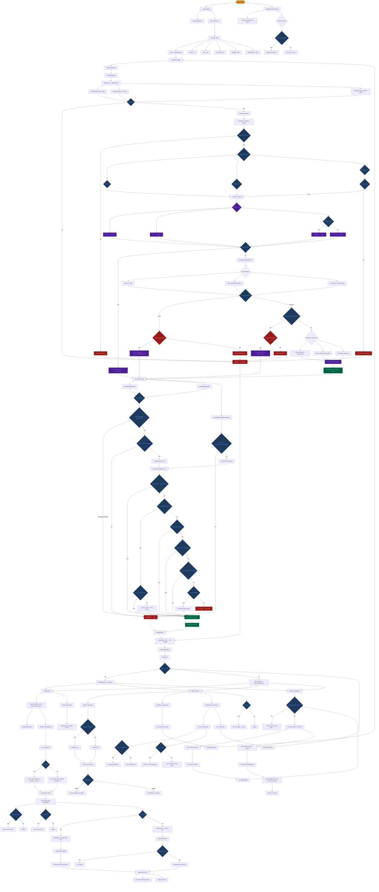

# SportGlobe v2 — Comprehensive Decision Tree

```mermaid
flowchart TD
    %% ===== APP LAUNCH =====
    START(["App Launch"]) --> APP["_app.tsx loads"]
    APP --> CSS["Import globals.css"]
    APP --> PAGE["Render index.tsx"]

    PAGE --> INIT_STATE["Initialize State"]
    INIT_STATE --> S1["date = getTomorrow()"]
    INIT_STATE --> S2["games = []"]
    INIT_STATE --> S3["filter = 'all'"]
    INIT_STATE --> S4["tripGames = []"]
    INIT_STATE --> S5["loading = false"]
    INIT_STATE --> S6["sidebarOpen = false"]

    S1 --> EFFECT["useEffect triggers"]
    EFFECT --> LOAD_GAMES["loadGames(date)"]

    %% ===== DATA FETCHING =====
    LOAD_GAMES --> SET_LOADING_TRUE["setLoading(true)"]
    SET_LOADING_TRUE --> PARALLEL_FETCH["Promise.all — parallel fetch"]

    PARALLEL_FETCH --> F1["fetchSport('bdl_nba', date)"]
    PARALLEL_FETCH --> F2["fetchSport('bdl_mlb', date)"]
    PARALLEL_FETCH --> F3["fetchSport('espn_ncaab', date)"]

    F1 & F2 & F3 --> CLIENT_FETCH{"res.ok?"}
    CLIENT_FETCH -- "No" --> RETURN_EMPTY["return [] — silent fail"]
    CLIENT_FETCH -- "Yes" --> PARSE_JSON["json.response || []"]

    PARSE_JSON --> BACKEND["Backend: /api/sports handler"]

    %% ===== BACKEND API HANDLER =====
    BACKEND --> SPORT_CHECK{"Valid sport param?"}
    SPORT_CHECK -- "No" --> ERR_400["400: Invalid sport"]
    SPORT_CHECK -- "Yes" --> SOURCE_CHECK{"Determine source"}

    SOURCE_CHECK --> IS_ESPN{"ESPN?"}
    SOURCE_CHECK --> IS_BDL{"BallDontLie?"}
    SOURCE_CHECK --> IS_APISPORTS{"API-Sports?"}

    IS_APISPORTS --> KEY_CHECK{"API key set?"}
    KEY_CHECK -- "No" --> ERR_500_KEY["500: Key not configured"]
    KEY_CHECK -- "Yes" --> CACHE_CHECK

    IS_ESPN --> CACHE_CHECK
    IS_BDL --> CACHE_CHECK

    %% ===== CACHING =====
    CACHE_CHECK --> TTL_SELECT{"Select TTL"}
    TTL_SELECT --> TTL_ESPN["ESPN → 6 hours"]
    TTL_SELECT --> TTL_BDL["BDL → 12 hours"]
    TTL_SELECT --> TTL_LIVE{"Today's date?"}
    TTL_LIVE -- "Yes" --> TTL_5M["API-Sports → 5 min"]
    TTL_LIVE -- "No" --> TTL_6H["API-Sports → 6 hours"]

    TTL_ESPN & TTL_BDL & TTL_5M & TTL_6H --> HIT_CHECK{"Cache valid?"}
    HIT_CHECK -- "Yes" --> CACHE_HIT["Return cached — X-Cache: HIT"]
    HIT_CHECK -- "No" --> UPSTREAM_FETCH["Fetch from upstream API"]

    %% ===== UPSTREAM FETCH =====
    UPSTREAM_FETCH --> HEADER_SELECT{"Select headers"}
    HEADER_SELECT --> H_ESPN["ESPN: no auth"]
    HEADER_SELECT --> H_BDL["BDL: Authorization header"]
    HEADER_SELECT --> H_API["API-Sports: x-apisports-key"]

    H_ESPN & H_BDL & H_API --> FETCH_TRY{"Fetch succeeds?"}
    FETCH_TRY -- "Error" --> STALE_ERR{"Stale cache exists?"}
    STALE_ERR -- "Yes" --> SERVE_STALE_ERR["200 + stale data — X-Cache: STALE-ERROR"]
    STALE_ERR -- "No" --> ERR_500["500: error message"]

    FETCH_TRY -- "Success" --> RATE_CHECK{"Rate limited? (API-Sports)"}
    RATE_CHECK -- "Yes" --> STALE_RATE{"Stale cache exists?"}
    STALE_RATE -- "Yes" --> SERVE_STALE["200 + stale data — X-Cache: STALE"]
    STALE_RATE -- "No" --> ERR_429["429: Rate limited"]
    RATE_CHECK -- "No" --> NORMALIZE

    %% ===== RESPONSE NORMALIZATION =====
    NORMALIZE{"Normalize response"}
    NORMALIZE --> N_ESPN["ESPN: {response: data.events}"]
    NORMALIZE --> N_BDL["BDL: {response: data.data}"]
    NORMALIZE --> N_API["API-Sports: data as-is"]

    N_ESPN & N_BDL & N_API --> STORE_CACHE["Store in memory cache"]
    STORE_CACHE --> RETURN_200["Return 200 — X-Cache: MISS"]

    %% ===== GAME PARSING =====
    RETURN_200 & CACHE_HIT & SERVE_STALE & SERVE_STALE_ERR --> PARSE_GAMES["Parse game data"]

    PARSE_GAMES --> P_NBA["parseBDLBasketball()"]
    PARSE_GAMES --> P_MLB["parseBDLBaseball()"]
    PARSE_GAMES --> P_NCAAB["parseESPNCollegeBasketball()"]

    P_NBA & P_MLB --> BDL_STATUS{"Game status?"}
    BDL_STATUS --> IS_SCHED{"isScheduled && !scorePlayed?"}
    IS_SCHED -- "No (already played)" --> SKIP_GAME["Skip game → null"]
    IS_SCHED -- "Yes" --> DATE_MATCH{"dateET matches target?"}
    DATE_MATCH -- "No" --> SKIP_GAME
    DATE_MATCH -- "Yes" --> GEOCODE_BDL["Geocode home team"]

    P_NCAAB --> NCAA_STATUS{"status === STATUS_SCHEDULED?"}
    NCAA_STATUS -- "No" --> SKIP_GAME
    NCAA_STATUS -- "Yes" --> GEOCODE_NCAA["Geocode venue/team"]

    %% ===== GEOCODING FALLBACK CHAIN =====
    GEOCODE_BDL & GEOCODE_NCAA --> GEO_CHAIN["Geocoding fallback chain"]

    GEO_CHAIN --> G1{"Exact team in TEAM_CITY?"}
    G1 -- "Yes" --> GEO_OK["Coordinates found ✓"]
    G1 -- "No" --> G2{"Non-North-American?"}
    G2 -- "Yes" --> G2A{"City or venue match?"}
    G2A -- "Yes" --> GEO_OK
    G2A -- "No" --> G2B["Country center + hash scatter"]
    G2B --> GEO_OK
    G2 -- "No" --> G3{"Partial team match?"}
    G3 -- "Yes" --> GEO_OK
    G3 -- "No" --> G4{"City in CITY_COORDS?"}
    G4 -- "Yes" --> GEO_OK
    G4 -- "No" --> G5{"Venue contains city name?"}
    G5 -- "Yes" --> GEO_OK
    G5 -- "No" --> G6{"Country fallback?"}
    G6 -- "Yes" --> G6A["US region hash scatter"]
    G6A --> GEO_OK
    G6 -- "No" --> GEO_FAIL["No coords → skip game"]

    GEO_OK --> BUILD_GAME["Build Game object"]
    GEO_FAIL --> SKIP_GAME
    SKIP_GAME --> FILTER_NULL[".filter(Boolean)"]
    BUILD_GAME --> FILTER_NULL

    FILTER_NULL --> SET_GAMES["setGames([...nba, ...mlb, ...ncaab])"]

    %% ===== LOAD ERROR PATH =====
    RETURN_EMPTY --> SET_GAMES
    ERR_400 & ERR_500_KEY & ERR_429 & ERR_500 --> RETURN_EMPTY

    SET_GAMES --> SET_LOADING_FALSE["setLoading(false)"]
    SET_LOADING_FALSE --> RENDER["Render UI"]

    %% ===== FILTERING & RENDERING =====
    RENDER --> FILTER_MEMO{"filter === 'all'?"}
    FILTER_MEMO -- "Yes" --> ALL_GAMES["filteredGames = all games"]
    FILTER_MEMO -- "No" --> SPORT_FILTER["filteredGames = games.filter(sport)"]

    ALL_GAMES & SPORT_FILTER --> RENDER_MAP["Render Map"]
    ALL_GAMES & SPORT_FILTER --> RENDER_HEADER["Render Header"]
    ALL_GAMES & SPORT_FILTER --> RENDER_SIDEBAR["Render TripSidebar"]

    %% ===== MAP RENDERING =====
    RENDER_MAP --> MAP_INIT["MapContainer: center=[39.8,-98.5] zoom=4"]
    MAP_INIT --> TILES["CartoDB dark tiles"]
    MAP_INIT --> MARKERS["Render GameMarkers"]

    MARKERS --> EACH_GAME["For each game"]
    EACH_GAME --> IN_TRIP{"isInTrip?"}
    IN_TRIP -- "Yes" --> MARKER_TRIP["Color: amber, Radius: 8, Weight: 3, Glow ✦"]
    IN_TRIP -- "No" --> MARKER_NORMAL["Color: sport color, Radius: 6, Weight: 1.5"]

    %% ===== MAP INTERACTIONS =====
    MARKER_TRIP & MARKER_NORMAL --> CLICK_MARKER["User clicks marker"]
    CLICK_MARKER --> POPUP["Open Popup with GameDetail"]

    POPUP --> SHOW_TIME{"game.startTime?"}
    SHOW_TIME -- "Yes" --> DISPLAY_TIME["Show start time (ET)"]
    SHOW_TIME -- "No" --> NO_TIME["Hidden"]

    POPUP --> SHOW_VENUE{"game.venue?"}
    SHOW_VENUE -- "Yes" --> DISPLAY_VENUE["Show venue name"]
    SHOW_VENUE -- "No" --> NO_VENUE["Hidden"]

    POPUP --> TRIP_BTN{"isInTrip?"}
    TRIP_BTN -- "Yes" --> BTN_REMOVE["Red button: 'Remove from Trip'"]
    TRIP_BTN -- "No" --> BTN_ADD["Amber button: '+ Add to Trip'"]

    %% ===== TRIP MANAGEMENT =====
    BTN_ADD --> ADD_TRIP["addToTrip(game)"]
    ADD_TRIP --> DEDUP{"Already in trip?"}
    DEDUP -- "Yes" --> NO_OP["No change"]
    DEDUP -- "No" --> PUSH_TRIP["Add game to tripGames"]

    BTN_REMOVE --> REMOVE_TRIP["removeFromTrip(id)"]
    REMOVE_TRIP --> FILTER_OUT["Filter game from tripGames"]

    PUSH_TRIP & FILTER_OUT --> UPDATE_TRIP_STATE["Update tripIds Set"]
    UPDATE_TRIP_STATE --> RERENDER_MARKERS["Re-render affected markers"]
    UPDATE_TRIP_STATE --> UPDATE_SIDEBAR["Update sidebar"]

    %% ===== SIDEBAR STATES =====
    RENDER_SIDEBAR --> TRIP_EMPTY{"tripGames.length === 0?"}
    TRIP_EMPTY -- "Yes" --> EMPTY_MSG["'Click markers on the map...'"]
    TRIP_EMPTY -- "No" --> TRIP_LIST["Sort by dateUTC, render list"]

    TRIP_LIST --> CLEAR_BTN["Show 'Clear All' button"]
    TRIP_LIST --> ITINERARY_BTN["Show 'Build Itinerary →' button"]

    CLEAR_BTN --> USER_CLEAR["User clicks Clear All"]
    USER_CLEAR --> CLEAR_ALL["setTripGames([])"]
    CLEAR_ALL --> TRIP_EMPTY

    ITINERARY_BTN --> USER_ITIN["User clicks Build Itinerary"]
    USER_ITIN --> BUILD_URL["Build Google Maps URL from sorted stops"]
    BUILD_URL --> OPEN_TAB["Open in new tab"]

    %% ===== MOBILE SIDEBAR TOGGLE =====
    RENDER_HEADER --> MOBILE_BTN["Mobile: Trip button"]
    MOBILE_BTN --> HAS_TRIPS{"tripGames.length > 0?"}
    HAS_TRIPS -- "Yes" --> BTN_ORANGE["Orange button"]
    HAS_TRIPS -- "No" --> BTN_DARK["Dark button"]

    BTN_ORANGE & BTN_DARK --> TOGGLE["User taps Trip button"]
    TOGGLE --> SIDEBAR_STATE{"sidebarOpen?"}
    SIDEBAR_STATE -- "toggle" --> SIDEBAR_OPEN["Overlay sidebar on mobile"]
    SIDEBAR_STATE -- "toggle" --> SIDEBAR_CLOSED["Hide sidebar on mobile"]

    %% ===== USER ACTIONS: DATE CHANGE =====
    RENDER_HEADER --> DATE_PICKER["DatePicker component"]
    DATE_PICKER --> DATE_CHANGE["User selects new date"]
    DATE_CHANGE --> SET_DATE["setDate(newDate)"]
    SET_DATE --> EFFECT

    %% ===== USER ACTIONS: FILTER CHANGE =====
    RENDER_HEADER --> SPORT_FILTERS["SportFilters component"]
    SPORT_FILTERS --> EACH_FILTER["For each sport filter"]
    EACH_FILTER --> ACTIVE_CHECK{"active === filter.key?"}
    ACTIVE_CHECK -- "Yes" --> ACTIVE_STYLE["Colored background"]
    ACTIVE_CHECK -- "No" --> INACTIVE_STYLE["Dark background"]

    EACH_FILTER --> COUNT_CHECK{"key === 'all'?"}
    COUNT_CHECK -- "Yes" --> SUM_ALL["Count = sum of all sports"]
    COUNT_CHECK -- "No" --> SPORT_COUNT["Count = games for that sport"]

    SPORT_FILTERS --> FILTER_CLICK["User clicks filter"]
    FILTER_CLICK --> SET_FILTER["setFilter(newFilter)"]
    SET_FILTER --> FILTER_MEMO

    %% ===== LOADING STATE =====
    RENDER_HEADER --> LOADING_CHECK{"loading?"}
    LOADING_CHECK -- "Yes" --> SHOW_SPINNER["Show 'Loading...' pulse"]
    LOADING_CHECK -- "No" --> NO_SPINNER["Hidden"]

    %% ===== GAME COUNT BADGE =====
    RENDER_MAP --> BADGE["Bottom-left badge"]
    BADGE --> GAME_COUNT["{filteredGames.length} games"]

    %% ===== SERVICE WORKER (PWA) =====
    START --> SW["Register service worker"]
    SW --> SW_INSTALL["Cache static assets on install"]
    SW --> SW_FETCH{"Network request"}
    SW_FETCH --> SW_NET{"Network available?"}
    SW_NET -- "Yes" --> SW_ONLINE["Fetch from network"]
    SW_NET -- "No" --> SW_CACHE["Serve from cache"]

    %% ===== STYLES =====
    classDef start fill:#F59E0B,stroke:#000,color:#000,font-weight:bold
    classDef error fill:#991B1B,stroke:#FCA5A5,color:#FCA5A5
    classDef success fill:#065F46,stroke:#6EE7B7,color:#6EE7B7
    classDef decision fill:#1E3A5F,stroke:#60A5FA,color:#60A5FA
    classDef cache fill:#4C1D95,stroke:#A78BFA,color:#A78BFA
    classDef action fill:#1a1a24,stroke:#9ca3af,color:#e5e7eb

    class START start
    class ERR_400,ERR_500_KEY,ERR_429,ERR_500,STALE_ERR,STALE_RATE,GEO_FAIL,SKIP_GAME,RETURN_EMPTY error
    class GEO_OK,BUILD_GAME,CACHE_HIT,SERVE_STALE,SERVE_STALE_ERR,RETURN_200 success
    class SPORT_CHECK,SOURCE_CHECK,IS_ESPN,IS_BDL,IS_APISPORTS,KEY_CHECK,HIT_CHECK,FETCH_TRY,RATE_CHECK,BDL_STATUS,IS_SCHED,DATE_MATCH,NCAA_STATUS,G1,G2,G2A,G3,G4,G5,G6,FILTER_MEMO,IN_TRIP,SHOW_TIME,SHOW_VENUE,TRIP_BTN,DEDUP,TRIP_EMPTY,HAS_TRIPS,SIDEBAR_STATE,ACTIVE_CHECK,COUNT_CHECK,LOADING_CHECK,CLIENT_FETCH,TTL_LIVE,SW_NET decision
    class CACHE_HIT,SERVE_STALE,SERVE_STALE_ERR,STORE_CACHE,TTL_ESPN,TTL_BDL,TTL_5M,TTL_6H,TTL_SELECT cache
```
